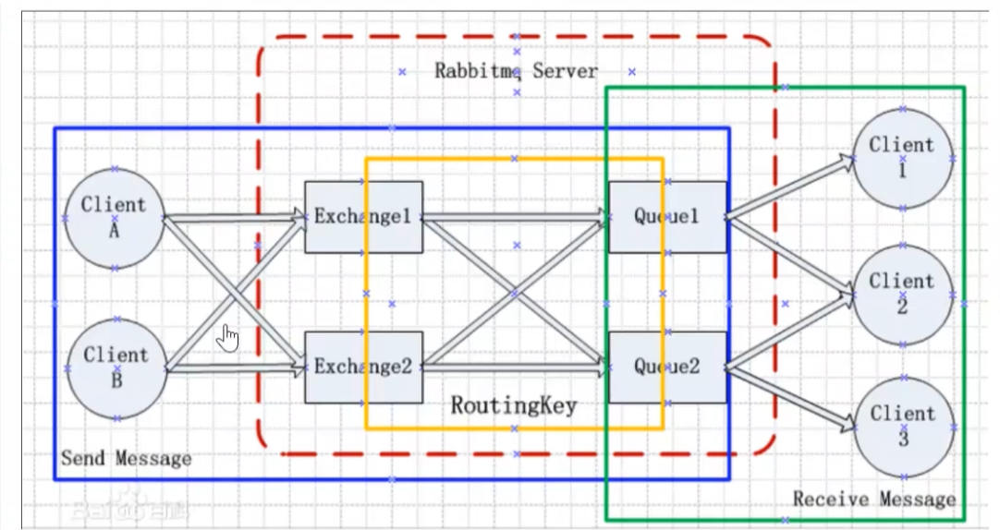
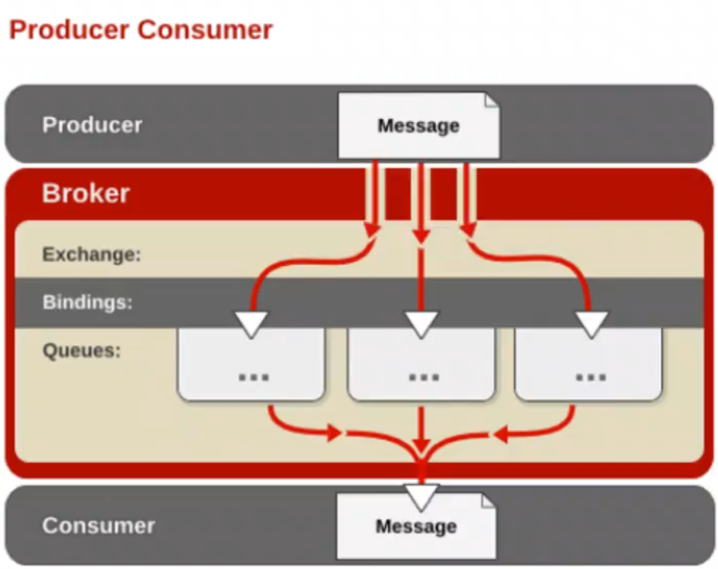
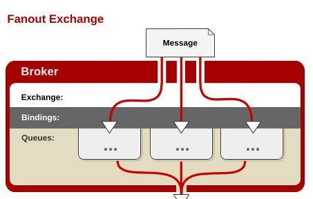
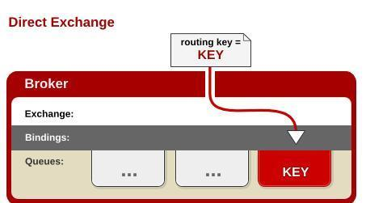
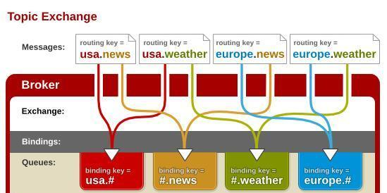

# RabbitMQ

## MQ介绍

1. ActiveMQ(Apache,JMS Java消息服务，性能慢，维护慢)
2. RocketMQ(阿里巴巴)
3. Kafka(大数据常用)
4. RabbitMQ(适合于普通的业务场景)

> 在以上的几款主流的MQ中间键，RabbitMQ虽然不是性能最高的，但是是非常适用于普通的开放业务场景
>
> RabbitMQ是一个在AMQP（Advanced Message Queuing Protocol）基础上完成的，可复用的企业消息系统
>
> 采用`Erlang`(是一种通用的面向并发的编程语言)语言实现的






### 概念说明

1. Broker：消息队列服务器实体
2. Exchange：消息交换机，它指定消息按什么规则，路由到那个队列
3. Queue：消息队列载体，每个消息都会被投入到一个或多个队列中
4. Binding：绑定，他的作用就是把exchange和queue按照路由规则绑定起来
5. Routing Key：路由关键字，exchange根据这个关键字进行消息投递
6. vhost：虚拟主机，一个Broker可以开设多个vhost，用做不同用户的权限分离
7. producer：消息生产者，就是投递消息的程序
8. consumer：消息消费者，就是接收消息的程序
9. chanel：消息通道，在客户端的每个连接里，可建立多个chanel，每个chanel代表一个会话任务

### 使用过程

1. 客户端连接到消息队列服务器，打开一个chanel
2. 客户端声明一个exchange，并设置相关属性
3. 客户端声明一个queue，并设置相关属性。
4. 客户端使用routing key，在exchange和queue之间建立好绑定关系
5. 客户端投递消息至exchange


## RabbitMQ的安装

[使用Docker部署RabbitMQ集群](https://www.cnblogs.com/vipstone/p/9362388.html)

## RabbitMQ使用介绍

### 队列式说明

[Rabbit官网的所有的队列模式](https://www.rabbitmq.com/getstarted.html)

1. Simplest：最简单的队列，一个生产者向一个队列中推送消息，在由一个消费者进行消费

   > 不由Exchange来转发，直接根据RoutingKey来发送

2. Work queue：两个及以上的消费者消费同一个队列

   	>  默认采用的是平均分配，一个消费者消费一条消息，如此循环
   	>
   	>  当有某个消费者处理消息耗费时间过长时，我们可以通过设置（限流+手工回复模式）来让处理快的消费者尽可能多的消费信息

3. publish/subscribe(Fanout Exchange):：生产者将消息发送给Exchange,由Exchange发送给所有绑定该Exchange的queue

   > Fanout Exchange：不处理路由键。你只需要简单的将队列绑定到交换机上。一个发送到交换机的消息都会被转发到与该交换机绑定的所有队列上。很像子网广播，每台子网内的主机都获得了一份复制的消息。Fanout交换机转发消息是最快的。

   

   

4. Routing (Direct Exchange)：处理路由键。需要将一个队列绑定到交换机上，要求该消息与一个特定的路由键完全匹配

   > Direct Exchange: 处理路由键。需要将一个队列绑定到交换机上，要求该消息与一个特定的路由键完全匹配。这是一个完整的匹配。如果一个队列绑定到该交换机上要求路由键 “abc”，则只有被标记为“abc”的消息才被转发，不会转发abc.def，也不会转发dog.ghi，只会转发abc。

   


5. Topic Exchange：将路由键和某模式进行匹配

   > 将路由键和某模式进行匹配。此时队列需要绑定要一个模式上。符号“#”匹配一个或多个词，符号“*”匹配不多不少一个词。因此“abc.#”能够匹配到“abc.def.ghi”，但是“abc.*” 只会匹配到“abc.def”。

   ​

   

6. Headers Exchanges：不处理路由键。而是根据发送的消息内容中的headers属性进行匹配

   >不处理路由键。而是根据发送的消息内容中的headers属性进行匹配。在绑定Queue与Exchange时指定一组键值对；当消息发送到RabbitMQ时会取到该消息的headers与Exchange绑定时指定的键值对进行匹配；如果完全匹配则消息会路由到该队列，否则不会路由到该队列。headers属性是一个键值对，可以是Hashtable，键值对的值可以是任何类型。而fanout，direct，topic 的路由键都需要要字符串形式的。
   >
   >匹配规则x-match有下列两种类型：
   >
   >x-match = all ：表示所有的键值对都匹配才能接受到消息
   >
   >x-match = any ：表示只要有键值对匹配就能接受到消息

### springboot 整合及使用

```xml
   <dependency>
			<groupId>org.springframework.boot</groupId>
			<artifactId>spring-boot-starter-amqp</artifactId>
		</dependency>
```


```java
/**
 * 自动配置
 * 	1、RabbitAutoConfiguration
 * 	2、自动配置了连接工厂ConnectionFactory
 * 	3、RabbitProperties封装了RabbitMQ的配置
 * 	4、AmqAdmin:系统的管理功能组件
 */
@EnableRabbit  //开启基于注解的RabbitMQ模式
@SpringBootApplication
public class AmqpDemoApplication {

	public static void main(String[] args) {
		SpringApplication.run(AmqpDemoApplication.class, args);
	}

}
```

```java
  @Autowired
    private RabbitTemplate rabbitTemplate;

    //管理rabbit后台的对象
    @Autowired
    private AmqpAdmin amqpAdmin;

	/**
     *发送简单消息，只要指定一个队列名即可
     */
    @Test
    void simplestSend() {
        rabbitTemplate.convertAndSend("simplest.queue","from spring simplestSend method");
    }


	 @Test
	void amqpAdminTest() {
		//声明一个Exchange
		amqpAdmin.declareExchange(new DirectExchange("springbootExchange.direct"));
		//声明一个队列
		amqpAdmin.declareQueue(new Queue("springboot.queue", true));
		//将queue绑定Exchange
		amqpAdmin.declareBinding(new Binding("springboot.queue",
				Binding.DestinationType.QUEUE,
				"springbootExchange.direct",
				"springboot.queue",null));
	}
```

